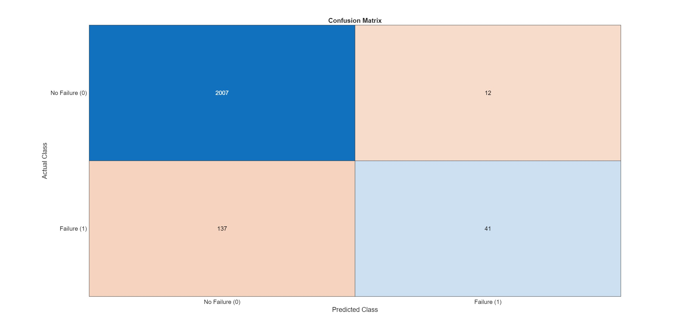
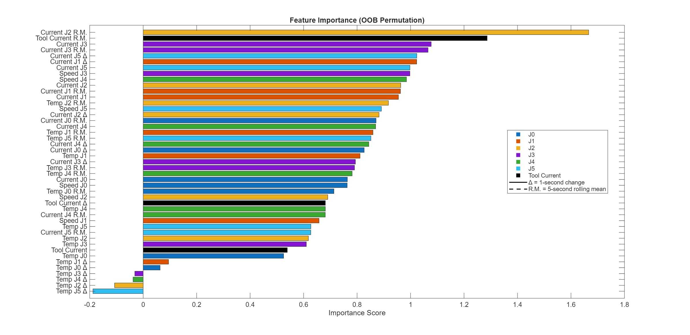
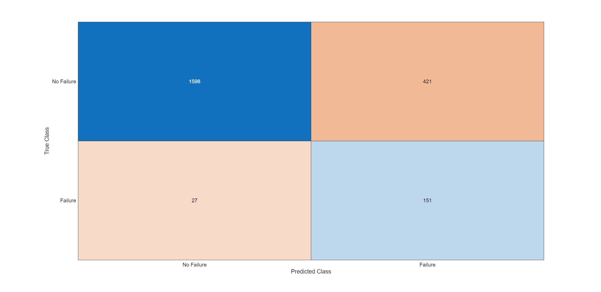
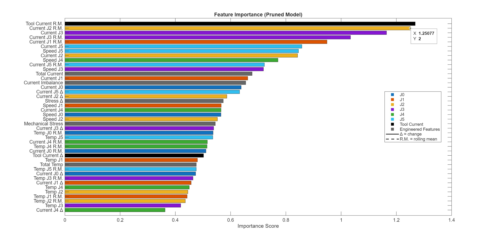

# MachineLearningProject
Below is the project report created for my Machine Learning Project completed as part of coursework for MCEN 3030 - Computational Methods at CU Boulder. We were instructed to learn from an LLM on how to begin and then optimize initial models for a typical classification type machine learning problem. See seperate folders for code.

## First Message to LLM (Chat GPT)

"I want to do a machine learning project (specifically a classification style problem) where the goal is to be able to predict if given variables will lead to a robot failure either thru shutdown or grip loss. The data I'm working with has columns  Current J0, Temperature J0, Current J1, Temperature J1 ... up to ... Current J5, Temperature J5, Speed J0 thru Speed J5 (J0 thru J5 being specific joints in the robot), Tool current (current of the gripper on the end of the robot), cycle (operational cycle count), Protective stops, and grip loss - total 22 columns consisting of 7409 instances. Some columns will contain NaN that I will need help dealing with later. Eventually I will ask for some matlab code to achieve this, but for now let's just discuss the best ways to model this data set. What do you think?"

## Discussing the Random Forest Model & Trend Features

Chat GPT likes the idea of using a Random Forest Model because these models are best to handle "messy, nonlinear and interactive" data. There are multiple sensors on multiple joints, where some of these measurements across joints are linked - for example a higher current is correlated to a higher temperature. There are also potentially many different thresholds that crossing could create failure, a temp gets to high, the robot may shut down to protect itself but at the same time if a speed gets to high on another joint this may indicate a current failure threshold being crossed. So there are many ways in which the robot may shut down or lose grip and different combinations of data will result in failures or success depending on the whole data set. Additionally, Random Forest Models are capable of dealing with missing values. 
Random Forest builds many decision trees, where "each tree is a collection of rules like: 
1) If Temperature J2 > 75 AND Current J2 > 10 → likely failure
2) If Speed J5 < 2 AND Tool Current high → possible grip loss
3) If all temps low → safe

Essentially, each randomly created tree is a set of piecewise rule based functions, which is ideal for modeling the connectedness of measurements on each joint and modeling if one joint is more important than another. Random Forest builds many hundreds of trees which each see different data: for example a tree may select J0 temp create a threshold, then moves to another data point J0 speed and creates another threshold eventually it will create a prediction for this path. The model then averages or "majority votes" on if certain parameters will cause failure or not. This Robot problem is essentially trying to model when these sets of conditions happen together -> faliure will occur.

Mathematically, chatGPT explained it as:

$$f(x) = \frac{1}{N} \sum_{i=1}^{N} T_i(x)$$

**Where:**

| Variable | Definition |
| :--- | :--- |
| **$T_i(x)$** | The prediction from an individual tree $i$ |
| **$N$** | The total number of trees in the forest |

Characteristics of Each Tree ($T_i$):

- A piecewise constant function: The model assigns a fixed value to specific regions of the data.
- Built from recursive splits: The tree grows by repeatedly partitioning the data into smaller, more "pure" subsets.

After this discussion, I asked chatGPT about "Trend Features". Which really clicked for me in terms of the problem and how robot failure would actually occur. To increase the accuracy of the model, understanding how each data point is changing with time may lead to better predicitons. Essentially, having a joint at temp = 50 may not directly indicate failure but if the temp had rapidly rose from 20 to 50, that is much more worrying and likely indicating failure soon. Trends will better distiguish failure and safe points that would otherwise look very similar. 

To implement this chatGPT recommended a few different methods:
1) a simple difference: ΔTemperature J2 = Temp(t) − Temp(t−1) ; ΔCurrent J3 = Current(t) − Current(t−1) ; which will capture if any value is increasing or decreasing
2) Rolling average: calculate the mean temp or mean voltage over the last few cycles as a baseline to compare current values to
3) Rolling slope: fit a slope over a small set of recent points to caputre the recent increasing or decreasing trend
4) Rolling variance: variance of a certain data point over the last N cycles to capture instability
5) Cumalitive stress: sum or average current or temperature over time on a joint to understand how much stress a joint has been exposed to

Each of these seem viable and will be interesting to see how one or multiple may better the accuracy of the model.

## First Model

Utilizing random forest: the first 70% of the data was used for training and the last 30% was used for validation. I went this path to take advantage of the time ordered data, so that I may add trend features to better predict failure or not. Utilizing a 70/30 random split would create data leakage in that training would use future data and validation would use past data, this may improve the model with the training and maybe even the validation set but would then "perform badly in production: ( https://www.kaggle.com/code/alexisbcook/data-leakage ).

The created trend features used are: a delta tracker for each joint's current and temperature as well as the tool's current. Additionally, a rolling mean of all those data points is tracked, the mean is calculated over the past 5 seconds. Due to utilzing the rolling mean, the first few rows for training and validation are disregarded so we can have the rolling mean for every actual training and validating point. The speeds of each joint weren't used as trend features just yet to keep first iteration of the model. However, a feature importance graph was created so that I may better interept which data points and/or features are critical or detrimental to model accuracy.

After initial running, I spent a lot of time fine tuning the plots for readable but also ease of analysis down the line, so iteration became easier. Below are the first model's confusion matrix and feature importance plot:

### Confusion Matrix

The model predicted no failure 2144 times, 2007 times correctly (~93.6%) and 137 times incorrectly (~6.4%). However, the model predicted failure 53 times, and was only correct 41 instances (~77.3%) and incorect 12 instances (~22.6%). Also there was 137 instances where the robot failed, and the model didn't actually predict it happening, which is more cases that the model actually predicts a failure - this is a major problem as we would rather have a predict a failure when it didn't actually happen then not predict failure at all and let the robot run itself into the ground. Intuitively, the model likes to simply predict no failure and knows it will be rather accurate as failures just don't happen often, it needs to be pushed to guess failure more but accurately of course. 

### Feature Importance Plot

chatGPT summarizes the importance score as: "Feature importance reflects the sensitivity of model performance to disruption of individual predictors, measured via out-of-bag permutation. This provides a model-agnostic estimate of each variable’s contribution to predictive accuracy."

Essentially, matlab's treebugger (Random Forest model) automatically calculates how the model's accuracy increases or decreases when it removes a certain feature. If that accuracy decreases a lot then that feature is very important and vice versa. This isn't perfected as correlated features will share importance but it's a good benchmark for analysis of relative importance of each feature. 

## Second Model

I began by providing chatGPT with the above confusion matrix analysis and the sorted features with their importance values, and broadly asking how might we improve the model.

The main goal of improvement should be to fix failure analysis, the model is very confident and very accurate when nothing is actually wrong. Because failures are much rarer, it is much more uncertain in actually detecting failure, we need to improve this accuracy. 

First we added a few more advanced features to provide the Random Trees a little more structure, these included: Total Current across all joints, Current Imbalance - if current is too concentrated somewhere, total temperature, mechanical stress - total current * total joint speeds, and the delta of that stress.

Then we discussed, feature pruning. Some features aren't providing helpful insight to the model and some might even be hurting it, so we added to the model such that it would normalize the feature importance and then cut any feature with importance less than 0.3 and retrain and revalidate using only kept features. The final retrained model would also utilize more trees (from 100 to 500).

Then we talked about how the classes, failure and non failure, are so imblanced. The first model just relied on the fact that almost all the time the robot was fine, so predicted the robot would be fine would lead to high accuracy, the random trees in the forest almost all voted for the robot to be fine as they would hardly be wrong. But now, we implemented undersampling, exposing the model to more failure cases while being trained and trying to really focus on what is causing those failure cases. 

Another improvement we discussed was switching from the binary failure and no failure to probabaility based failing. The majority voting system in Random Forest allows for the majority to dominate and thus many trees only voted failure with an very high degree of confidence. So now instead of each decision path (tree) outputing failure or not, they output a probability of failure thus the vote summed by all the trees is more representative of how close the robot is to failure, potentially  making the model predict more failures opposed to just guessing it will be fine. 

Then we created an adjustable decision threshold. The default threshold 0.5 strongly favors the majority class (no failure). Thus most every tree leads to guessing no failure. When that bar is lowered, the sensitivity to failure signals increasing. Now less tress have to indicate possible failure for the model to decide it's safe to predict failure. Earlier and weaker failures signals will be taken much more seriously. We settled on a threshold of 0.3 - as you will see in the confusion matrix this leads to lots of false positives, however generating a false positive is much better for the robot than letting a failure slip by unpredicted. Some metrics were outputed to determine the effect of changing this threshold.

### Confusion Matrix

Original features: 50 | Kept: 42 | Prunned: 8

Precision: 0.264 - compared to previous model ~0.75 - ~0.66

Recall (FAILURE DETECTION): 0.848 most important - catching failures much more often then previous model's ~0.25 - ~0.20

Predicted failure rate: 0.260 - how often model predicted failure (compared to ~0.028 - ~0.022 in previous model) 

The precision vs. recall tradeoff is real, but in the context of this problem having a false positive may be beneficial and may point to early failure signs, but much more importantly, not being able to predict a failure is much worse which model 1 struggled with. 

### Feature Importance Plot

As in the previous model, similar features are near the top: the rolling mean of current in the second joint, total current etc. Joints 2 and 3 remain heavily important and the added advanced features seem to just add some solid additonal context for the model. Pruning the features reduced the noise that irrelevant features were creating for the model. Potentially the threshold for prunning could be reduced to 0.4, but prunning any features with some positive importance is never ideal. 
